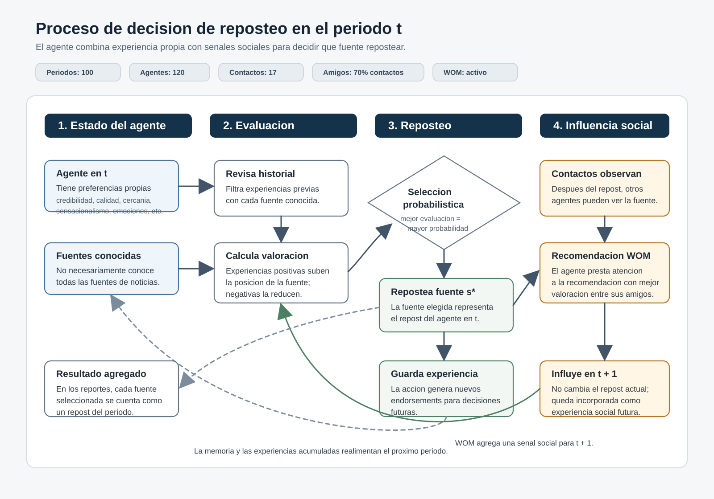

DESCRIPCIÓN ES LARGA, PERO ES BUENO LEERLA PARA TENER LA BIG PICTURE ACTUAL;

En cada periodo, un agente decide qué noticia repostear combinando dos fuentes de influencia: su experiencia con las fuentes de información y las recomendaciones que recibe de otros agentes.
Al inicio de la simulación, cada agente conoce un conjunto de fuentes de noticias (NO NECESARIAMENTE CONOCE TODAS). También tiene preferencias propias: por ejemplo, cuánto valora la credibilidad, la calidad de la información, la cercanía política, el sensacionalismo, las emociones que despierta una noticia, entre otros atributos.
Durante un periodo, el agente evalúa las fuentes que conoce. Para hacerlo, considera su historial de experiencias con esas fuentes: si en el pasado una fuente produjo evaluaciones positivas para sus preferencias, esa fuente queda mejor posicionada; si produjo evaluaciones negativas, queda peor posicionada.
Con esas evaluaciones, el agente elige una fuente para repostear. La elección no es completamente automática ni siempre favorece a la fuente mejor evaluada. Las fuentes mejor evaluadas tienen más probabilidad de ser seleccionadas, pero existe variabilidad: el agente puede elegir otra fuente conocida.
Una vez que el agente repostea una noticia de una fuente, esa acción genera una nueva experiencia para él. Esa experiencia se guarda y puede influir en sus decisiones futuras. Así, el comportamiento del agente cambia con el tiempo: no decide solo por sus preferencias iniciales, sino también por lo que ha experimentado durante la simulación.
Después de que los agentes repostean, aparece la influencia social. Si la comunicación entre agentes está activada (ES DECIR, WOM ACTIVADO, ALGO QUE SIEMPRE DEBE PASAR), cada agente observa lo que repostearon sus contactos. Si varios contactos recomendaron o repostearon distintas fuentes, el agente presta más atención a la recomendación que viene con mejor valoración.
Esa recomendación social no necesariamente hace que el agente repostee inmediatamente esa noticia en el mismo periodo. Más bien, queda incorporada como una influencia para el periodo siguiente. Si la fuente recomendada era desconocida para el agente, puede pasar a formar parte de su conjunto de fuentes conocidas.

En resumen, el comportamiento de un agente en cada periodo sigue este ciclo:
1. Revisa las fuentes de noticias que conoce.
2. Evalúa esas fuentes según sus preferencias y experiencias acumuladas.
3. Elige probabilísticamente una fuente para repostear.
4. Guarda esa nueva experiencia.
5. Recibe señales sociales desde otros agentes.
6. Usa esas señales para influir sus decisiones futuras.

Así, la difusión de noticias en el modelo no depende solo de las características de las fuentes, sino también de la memoria de cada agente y de la influencia social dentro de la red.

Datos de la simulación usado por ahora:
PERIODOS: 100
AGENTES: 120
CONTACTOS: 17
AMIGOS: 70% de contactos (A quienes escucha)
